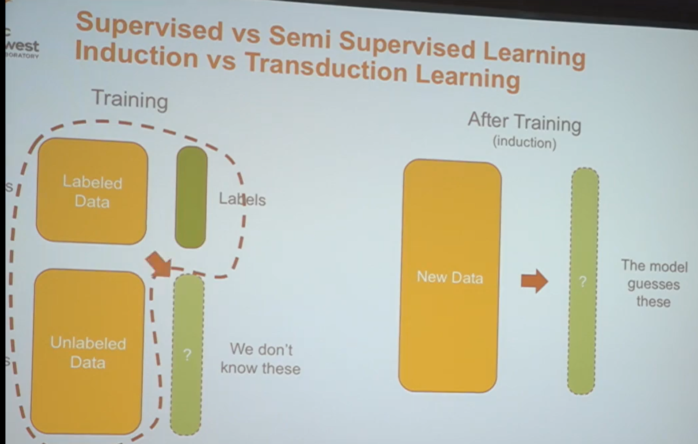
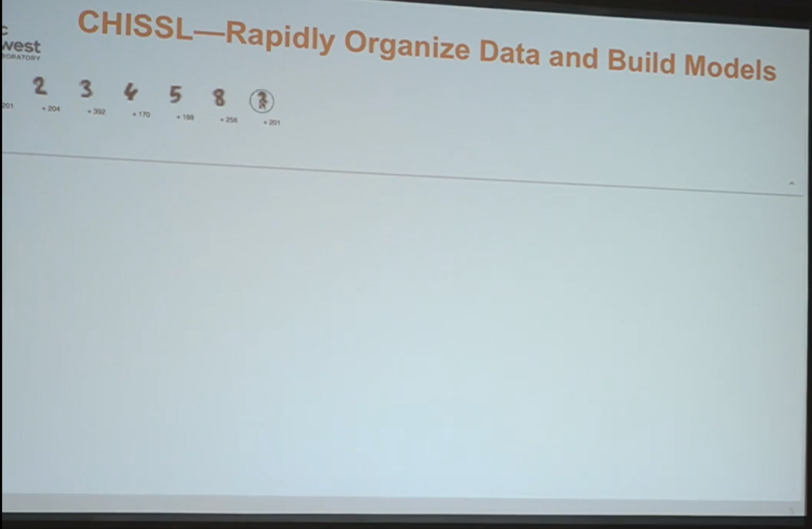
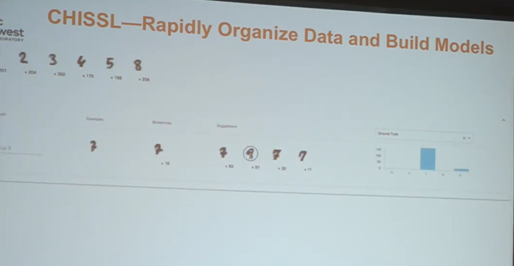
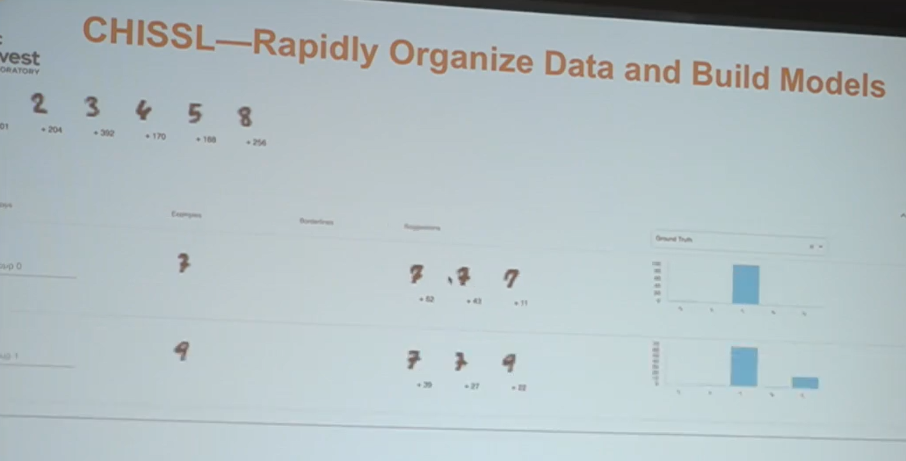
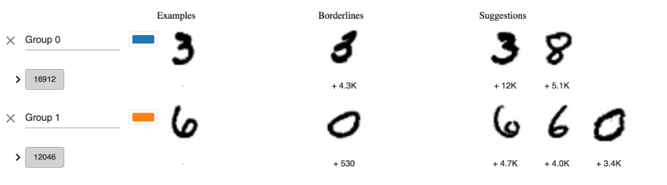

# ChisslR
A R port of [pnnl's chissl](https://github.com/pnnl/chissl)

Paper about [Chissl](https://dl.acm.org/citation.cfm?id=3302280)

YouTube video about [Chissl](https://youtu.be/VAsFlZGjL5I)

Dustin's Chissl [Powerpoint](https://github.com/gabefair/Rhissl/raw/master/Lookbook/ACM%20IUI%20CHISSL.pptx)

# Goal 
Provide Transduction during model training of unlabled data to improve training of the model. See the left red arrow in the below image.

# Reqirements Lookbook
Here is a description of what we need to do for this project

- [ ] 1st) Load the results of an Mnist Training

- [ ] 2nd) Display these initial results as a header to the shiny app as seen in the image below.
Lets just provide this via a quick k-means clustering. (we could even have this pre-computed) 

- [ ] 3rd) Provide the ability to click on one of these labels to invoke the editing of that group. In the image above the user is clicking on the number "7". The image below shows the first group editor menu. Notice the number "7" is removed from the header

- [ ] 4rd) As seen in the images above when the user clicks on one of the images "9", it creates a second group to label. 

The below image is provided to better highlight the column names of the group editor.

## Python Requirements
`conda install flask matplotlib networkx nltk numpy pandas pymongo scipy scikit-learn`
`conda install -c conda-forge umap-learn`

# Installation
You will need `mongodb` installed on your system. 
`brew install mongodb`

Then run the `download_chissl_mongodb` command located in `helpers/data-prep.R`

Create a mongo db by the name of `chissl` and then import the downloaded `chissl.agz` by performing a `mongorestore` or by using studio3T. This command might work `mongorestore --db chissl --gzip --archive=chissl.agz`

Run the backend chissl flask (python) server located in the chissl folder. 

`python server.py -p 8891 -d -m localhost` or try `python server.py -p 9101 -d -m localhost`

Check if it is working by going to: http://127.0.0.1:8891/api/applications/

# Reference code
https://gist.github.com/mathDR/3a2a081e4f3089920fd8aecefecbe280

