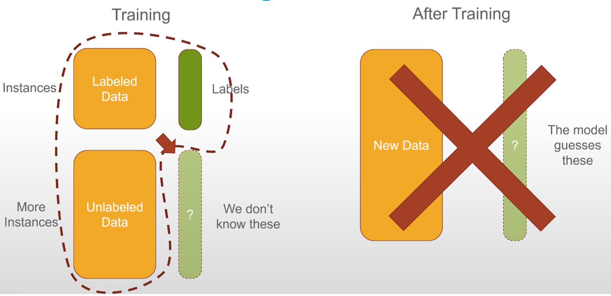

# chisslR
A R port of [pnnl's chissl](https://github.com/pnnl/chissl)

Paper about [chissl](https://dl.acm.org/citation.cfm?id=3302280)

YouTube video about [chissl](https://youtu.be/VAsFlZGjL5I)

Dustin's chissl [powerpoint](https://github.com/gabefair/ChisslR/raw/master/Lookbook/ACM%20IUI%20CHISSL.pptx)

# Goal 
Provide interactive learning during model training of unlabelled data to improve training of the model. See the left red arrow in the below image.

## Requirements
1) Python

`conda install flask matplotlib networkx nltk numpy pandas pymongo scipy scikit-learn`

`conda install -c conda-forge umap-learn`

2) You will need `mongodb` installed on your system.

`brew install mongodb` if you are on a Mac or your own way if so preferred

3) Node

4) R with the following packages

`devtools::install_github("react-R/reactR")`

`install.packages(c("usethis", "htmlwidgets", "shiny", "shinythemes", "sortable", "cowplot", "textdata", "topicmodels", "tidytext", "dplyr", "tidyverse", "feather", "viridis", "stringr"))`

# Installation
1) Once all the above is done go to the `chissl/python-chissl` folder and run: `pip install -e .`

2) Create a mongo db by the name of `chissl` and then import the downloaded `chissl.agz` by performing a `mongorestore` or by using studio3T. This command should work `mongorestore --db chissl --gzip --archive=chissl.agz`

3) Start the react app by going to the `chissl/react-chissl/` folder and running `npm start`. Which will start both the flask backend and the react app.

4) Then run the `download_chissl_mongodb` command located in `helpers/data-prep.R`

# Standalone
To run the flask backend standalone:
Run the backend chissl flask (python) server located in the chissl folder. 

`python server.py -p 8891 -d -m localhost` or try `python server.py -p 9101 -d -m localhost`

Check if it is working by going to: http://127.0.0.1:8891/api/applications/

# Reference code
https://gist.github.com/mathDR/3a2a081e4f3089920fd8aecefecbe280

